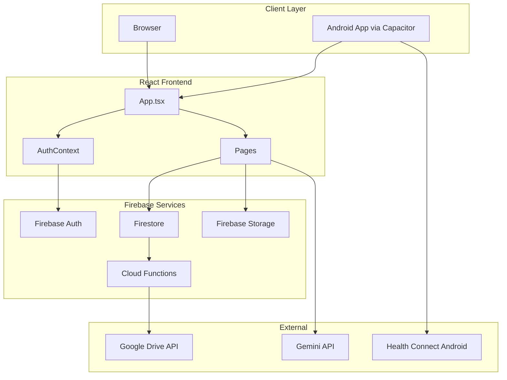
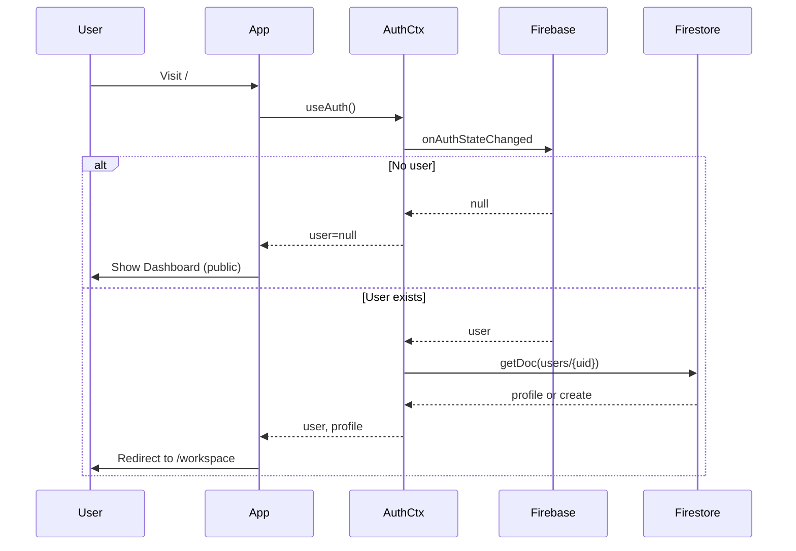
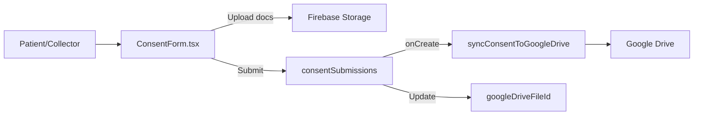

# Sally Health WORKFLOWS — Complete Architectural Plan

## 1. Overview

The project is a **template-driven form platform** (FormFlow) customized for **Sally Health**, a healthcare provider. It combines:

- **Form builder** — Drag-and-drop forms, AI generation, templates
- **Sally Health workflows** — Consent forms, Precision Screening, Precision Diagnostic
- **Patient Portal** — Patient-facing view of own records only
- **Staff/admin views** — Consent Submissions, form management, Health Data

---

## 2. Tech Stack

| Layer     | Technology                                                |
| --------- | --------------------------------------------------------- |
| Frontend  | React 19, Vite 6, Tailwind 4                              |
| Auth      | Firebase Auth (Google popup, email/password)              |
| Database  | Firestore                                                 |
| Storage   | Firebase Storage (document uploads)                       |
| Functions | Firebase Cloud Functions (Node 18)                        |
| AI        | Google Gemini (form generation, chat, transcription, TTS) |
| Mobile    | Capacitor (Android app)                                   |
| Hosting   | Firebase Hosting                                          |

---

## 3. High-Level Architecture

---

## 4. Route Architecture

| Route                                                    | Access                        | Purpose                                                        |
| -------------------------------------------------------- | ----------------------------- | -------------------------------------------------------------- |
| `/`                                                      | Public (signed-in → redirect) | Landing; redirects to `/workspace` if authenticated            |
| `/login`, `/register`                                    | Public                        | Auth                                                           |
| `/workspace`                                             | Protected                     | My Workspace (Dashboard) — forms, AI, Consent Form card        |
| `/consent`                                               | Protected                     | Sally Health consent form                                      |
| `/consent-submissions`                                   | Protected                     | Staff list of all consent submissions                          |
| `/patient-portal`                                        | Protected                     | Patient-only view of own consents and screenings               |
| `/precision-screening`                                   | Protected                     | Wizard-style precision screening                               |
| `/precision-diagnostic`                                  | Protected                     | Single-page diagnostic with patient info and insurance uploads |
| `/health`                                                | Protected                     | Health Connect sync (steps, weight, height)                    |
| `/templates`, `/templates/:type`, `/templates/:type/:id` | Protected                     | Template marketplace and preview                               |
| `/builder/:id`                                           | Protected                     | Form builder                                                   |
| `/view/:id`                                              | **Public**                    | Form fill (no auth required)                                   |
| `/submissions/:id`                                       | Protected                     | Submissions for a form (owner only)                            |
| `/settings`, `/integrations`, `/products`                | Protected                     | Settings and integrations                                      |

**ProtectedRoute** — Wraps routes; checks `useAuth().user`. Loading → spinner; no user → redirect to `/`.

---

## 5. Data Model

### Firestore Collections

| Collection                      | Key Fields                                                                                                                 | Purpose                          |
| ------------------------------- | -------------------------------------------------------------------------------------------------------------------------- | -------------------------------- |
| `users`                         | uid, email, displayName, photoURL, createdAt                                                                               | User profiles (synced from Auth) |
| `forms`                         | ownerId, title, description, fields[], updatedAt                                                                           | Form definitions from Builder    |
| `forms/{id}/submissions`        | formId, data, submittedAt                                                                                                  | Form responses                   |
| `consentSubmissions`            | submittedByUid, collectorName, patient, respiratory, uti, sti, nailFungus, signature, sendToGoogleDrive, googleDriveFileId | Sally Health consent forms       |
| `precisionScreenings`           | createdByUid, patient, responses, results, consent                                                                         | Wizard screening results         |
| `precisionDiagnosticScreenings` | createdByUid, patient, responses, results, consent                                                                         | Diagnostic form results          |

### Firebase Storage Paths

- `consent-uploads/{uid}/{kind}-{timestamp}-{filename}` — Consent form documents (ID, insurance cards)
- `precision-diagnostic/{uid}/{kind}-{timestamp}-{filename}` — Diagnostic document uploads

### Firestore Indexes (firestore.indexes.json)

- `consentSubmissions`: (submittedByUid, submittedAt DESC)
- `precisionScreenings`: (createdByUid, createdAt DESC)
- `precisionDiagnosticScreenings`: (createdByUid, createdAt DESC)

---

## 6. Auth Flow

- **AuthProvider** wraps app; uses `onAuthStateChanged` and `getRedirectResult`
- **User profile** — Created in `users/{uid}` on first sign-in (uid, email, displayName, photoURL)
- **Persistence** — `browserLocalPersistence`
- **Methods** — Google popup, email/password (Register, Login)

---

## 7. Sally Health Feature Flows

### Consent Form Flow

**Consent form data:** Collector name, patient (name, email, DOB, gender, phone, address), insurance (Medicare Traditional, Advantage, Medicaid with Aetna/BCBS/Humana/United), document uploads (ID front/back, insurance front/back), symptom screenings (respiratory, UTI, STI, nail fungus), consent + signature.

### Patient vs Staff Views

| View                    | Route                  | Data Filter                                                                     |
| ----------------------- | ---------------------- | ------------------------------------------------------------------------------- |
| **Patient Portal**      | `/patient-portal`      | `submittedByUid == user.uid` (consent), `createdByUid == user.uid` (screenings) |
| **Consent Submissions** | `/consent-submissions` | All documents (staff/admin)                                                     |

### Precision Screening vs Diagnostic

| Form                 | Type           | Storage                       | Key Difference                                          |
| -------------------- | -------------- | ----------------------------- | ------------------------------------------------------- |
| Precision Screening  | 12-step wizard | precisionScreenings           | Step-by-step; draft in localStorage                     |
| Precision Diagnostic | Single page    | precisionDiagnosticScreenings | Patient info + insurance uploads + same screening logic |

---

## 8. External Integrations

| Integration        | Purpose                                                      | Config                                          |
| ------------------ | ------------------------------------------------------------ | ----------------------------------------------- |
| **Google Drive**   | Sync consent JSON on submit                                  | `DRIVE_FOLDER_ID` in functions/.env.{projectId} |
| **Gemini**         | Form generation, FormFlow Assistant chat, transcription, TTS | `GEMINI_API_KEY` (vite env)                     |
| **Health Connect** | Steps, weight, height on Android                             | Capacitor plugin; `health-connect-client.ts`    |

---

## 9. Key File Reference

| Path                                                                   | Purpose                                         |
| ---------------------------------------------------------------------- | ----------------------------------------------- |
| [src/App.tsx](src/App.tsx)                                             | Routes, ProtectedRoute, DashboardOrConsent      |
| [src/AuthContext.tsx](src/AuthContext.tsx)                             | Auth state, user profile sync                   |
| [src/firebase.ts](src/firebase.ts)                                     | Firebase init, Auth, Firestore, Storage exports |
| [src/pages/ConsentForm.tsx](src/pages/ConsentForm.tsx)                 | Sally Health consent form                       |
| [src/pages/PatientPortal.tsx](src/pages/PatientPortal.tsx)             | Patient-only portal                             |
| [src/pages/ConsentSubmissions.tsx](src/pages/ConsentSubmissions.tsx)   | Staff consent list                              |
| [src/pages/PrecisionDiagnostic.tsx](src/pages/PrecisionDiagnostic.tsx) | Diagnostic with patient + insurance             |
| [src/components/Navbar.tsx](src/components/Navbar.tsx)                 | Nav with Patient Portal, Workspace, etc.        |
| [functions/src/index.ts](functions/src/index.ts)                       | syncConsentToGoogleDrive                        |
| [firestore.rules](firestore.rules)                                     | Security rules                                  |
| [firestore.indexes.json](firestore.indexes.json)                       | Composite indexes                               |

---

## 10. Deployment

- **Hosting:** Firebase Hosting — site `gen-lang-client-0777929601`, `dist` build
- **Firestore:** Rules + indexes deployed with `firebase deploy`
- **Functions:** `firebase deploy --only functions`; requires `DRIVE_FOLDER_ID` and Google Drive API enabled
- **Build:** `npm run build` (Vite)
- **Android:** `npm run cap:sync` + `cap run android` for Capacitor

---

## 11. Security Summary

- **Protected routes** require `user` from AuthContext; otherwise redirect to `/`
- **ConsentSubmissions** — Any authenticated user can read (staff view)
- **Patient Portal** — Queries filtered by `submittedByUid` / `createdByUid` == current user
- **Form submissions** — Create allowed by anyone (public forms); read by form owner only
- **consentSubmissions** — Create only when `submittedByUid == auth.uid`

